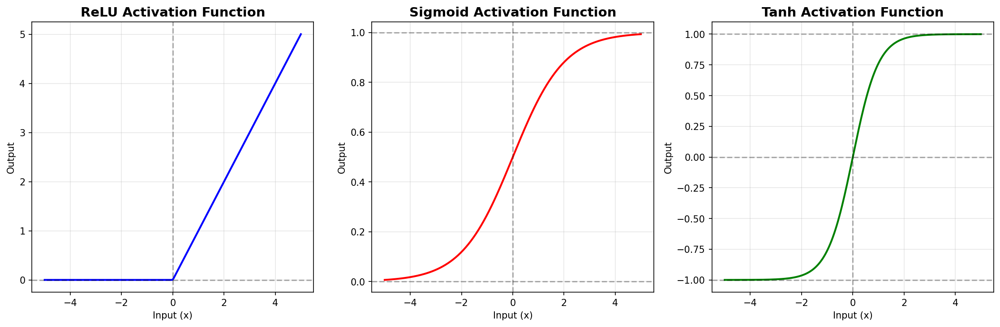
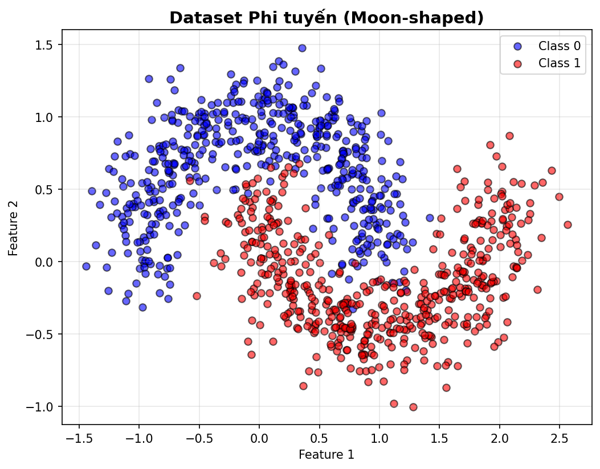
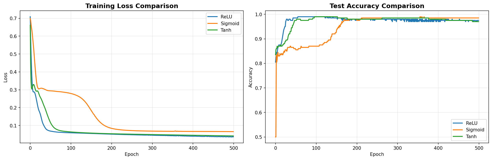
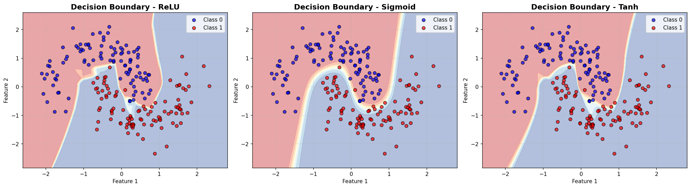
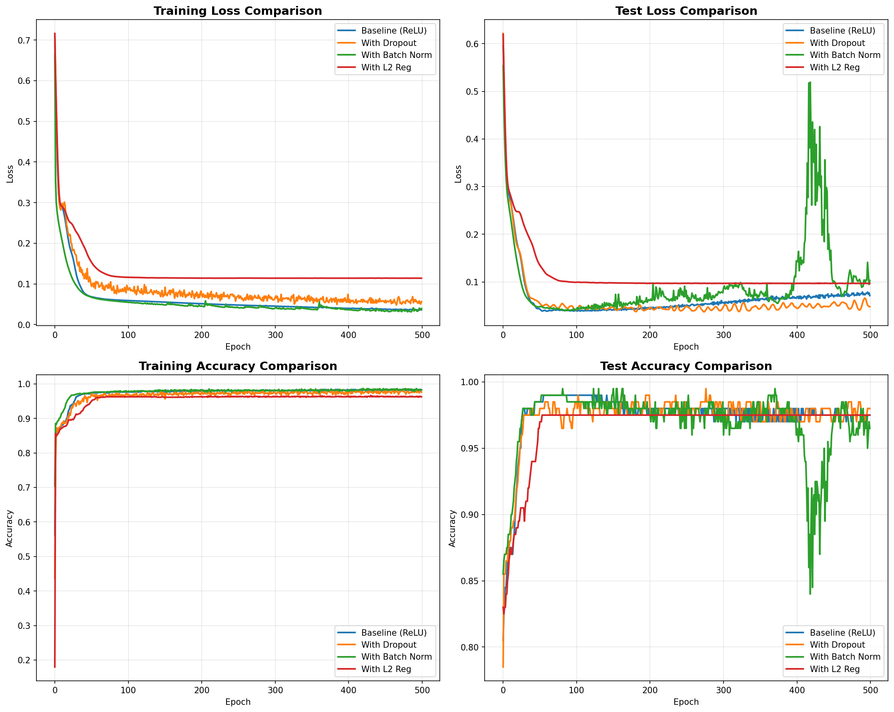
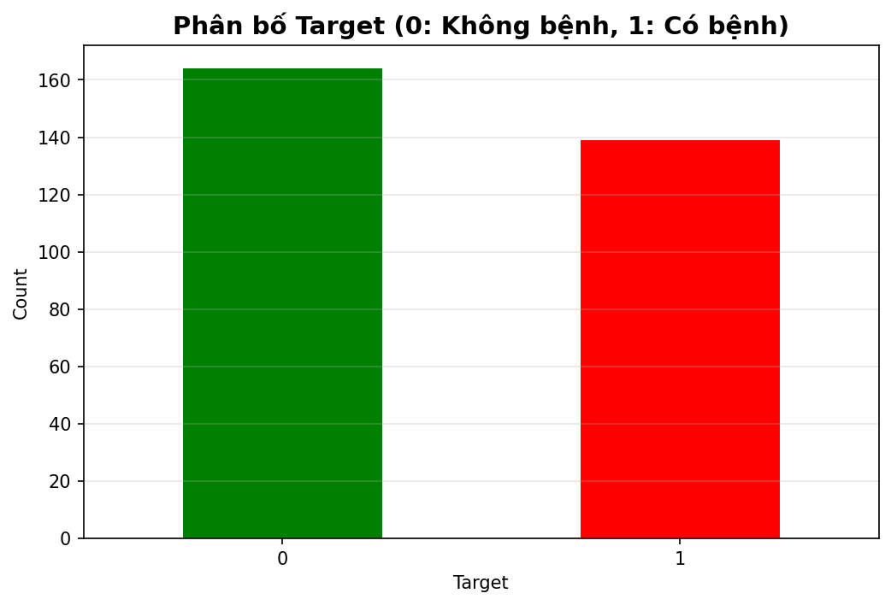
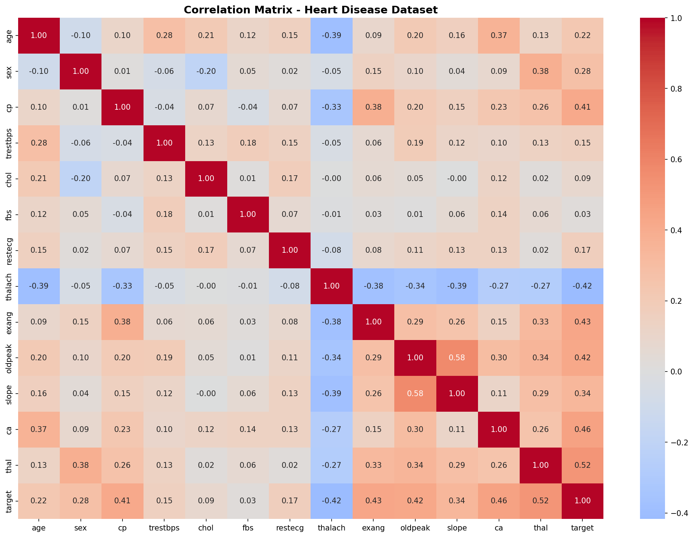
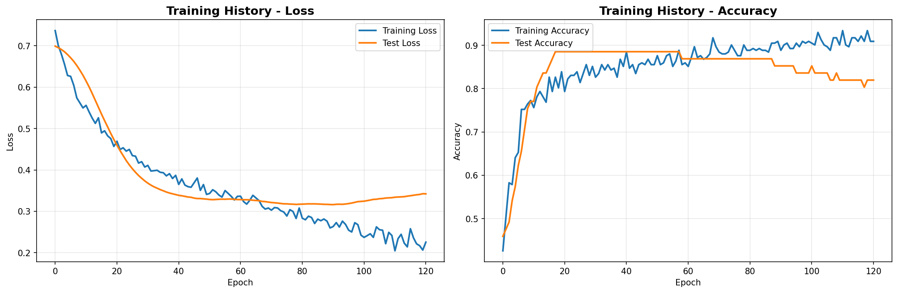
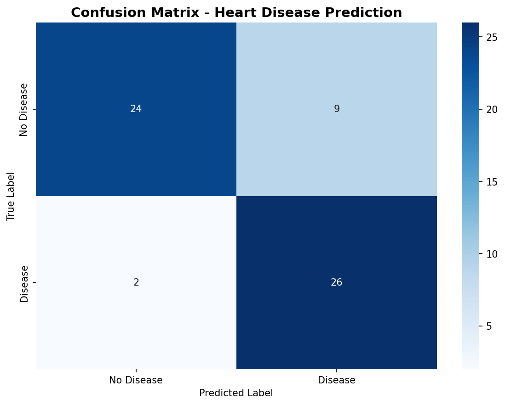
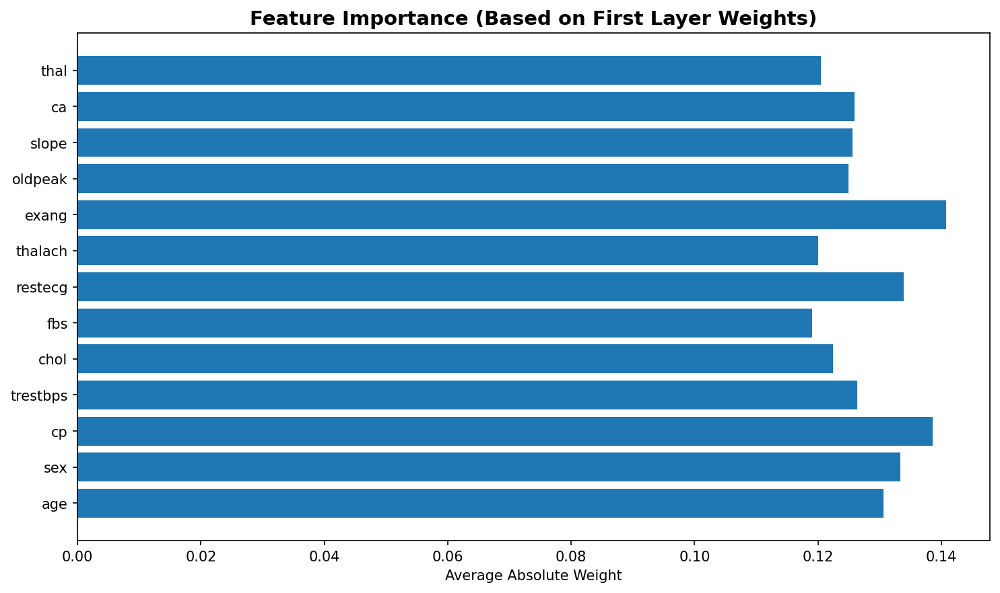

# Multi-Layer Perceptron (MLP): Từ Lý thuyết đến Thực hành

## Giới thiệu

**Multi-Layer Perceptron (MLP)** là một trong những kiến trúc mạng neural cơ bản và quan trọng nhất trong Deep Learning. Khác với Logistic Regression chỉ có một layer tuyến tính, MLP có khả năng học các mối quan hệ phi tuyến phức tạp nhờ vào nhiều hidden layers và các hàm kích hoạt phi tuyến.

Trong bài viết này, chúng ta sẽ cùng nhau:

- Hiểu kiến trúc và nguyên lý hoạt động của MLP
- So sánh các hàm kích hoạt khác nhau: ReLU, Sigmoid, Tanh
- Áp dụng các kỹ thuật cải thiện: Dropout, Batch Normalization, L2 Regularization
- Thực hành với **3 bài toán thực tế**: Regression, Classification, và Image Classification
- Case Study: **Dự đoán bệnh tim (Heart Disease Prediction)**

---

## Phần 1: Nền tảng Lý thuyết

### 1.1. MLP là gì?

**Multi-Layer Perceptron** là một mạng neural feedforward gồm nhiều layers:

1. **Input Layer**: Nhận dữ liệu đầu vào
2. **Hidden Layers**: Một hoặc nhiều layers ẩn để học các đặc trưng phức tạp
3. **Output Layer**: Cho ra kết quả dự đoán

**Kiến trúc tổng quát:**

```
Input → Hidden Layer 1 → Hidden Layer 2 → ... → Output Layer
```

Mỗi layer bao gồm:

- Linear transformation: \( z = W \cdot x + b \)
- Activation function: \( a = f(z) \)

**Tại sao MLP mạnh hơn Logistic Regression?**

- **Logistic Regression**: Chỉ học được decision boundary tuyến tính
- **MLP**: Có thể học được decision boundary phi tuyến phức tạp nhờ hidden layers

> **Universal Approximation Theorem**: Một MLP với ít nhất một hidden layer (đủ lớn) có thể xấp xỉ bất kỳ hàm liên tục nào.

### 1.2. Các hàm kích hoạt (Activation Functions)

Hàm kích hoạt giúp mạng neural học được các mối quan hệ phi tuyến. Dưới đây là 3 hàm kích hoạt phổ biến nhất:

#### 1.2.1. ReLU (Rectified Linear Unit)

**Công thức:**

$$
\text{ReLU}(x) = \max(0, x) = \begin{cases}
x & \text{if } x > 0 \\
0 & \text{if } x \leq 0
\end{cases}
$$

**Đạo hàm:**

$$
\text{ReLU}'(x) = \begin{cases}
1 & \text{if } x > 0 \\
0 & \text{if } x \leq 0
\end{cases}
$$

**Ưu điểm:**

- Tính toán nhanh (chỉ cần so sánh với 0)
- Giải quyết vấn đề vanishing gradient
- Thường cho kết quả tốt nhất trong Deep Learning

**Nhược điểm:**

- Dying ReLU problem: Neuron có thể "chết" (luôn output 0)

#### 1.2.2. Sigmoid

**Công thức:**

$$
\sigma(x) = \frac{1}{1 + e^{-x}}
$$

**Đạo hàm:**

$$
\sigma'(x) = \sigma(x) \cdot (1 - \sigma(x))
$$

**Ưu điểm:**

- Đầu ra trong khoảng (0, 1), phù hợp cho xác suất
- Smooth và differentiable

**Nhược điểm:**

- Vanishing gradient: Gradient rất nhỏ khi |x| lớn
- Không zero-centered (output luôn dương)
- Tính toán chậm (exp operation)

#### 1.2.3. Tanh (Hyperbolic Tangent)

**Công thức:**

$$
\tanh(x) = \frac{e^x - e^{-x}}{e^x + e^{-x}} = \frac{2}{1 + e^{-2x}} - 1
$$

**Đạo hàm:**

$$
\tanh'(x) = 1 - \tanh^2(x)
$$

**Ưu điểm:**

- Zero-centered (output trong khoảng (-1, 1))
- Gradient lớn hơn Sigmoid

**Nhược điểm:**

- Vẫn bị vanishing gradient (nhẹ hơn Sigmoid)
- Tính toán chậm

### 1.3. Các kỹ thuật cải thiện MLP

#### 1.3.1. Dropout

**Ý tưởng:** Trong quá trình training, ngẫu nhiên "tắt" một tỷ lệ neurons để tránh overfitting.

**Công thức:**

$$
y = \text{Dropout}(x, p) = \begin{cases}
\frac{x}{1-p} & \text{với xác suất } (1-p) \\
0 & \text{với xác suất } p
\end{cases}
$$

**Lợi ích:**

- Giảm overfitting
- Tạo ensemble effect (nhiều mô hình con)

#### 1.3.2. Batch Normalization

**Ý tưởng:** Chuẩn hóa input của mỗi layer để có mean=0 và variance=1.

**Công thức:**

$$
\hat{x} = \frac{x - \mu_B}{\sqrt{\sigma_B^2 + \epsilon}}
$$

$$
y = \gamma \hat{x} + \beta
$$

**Lợi ích:**

- Training nhanh hơn
- Cho phép learning rate lớn hơn
- Giảm phụ thuộc vào weight initialization

#### 1.3.3. L2 Regularization (Weight Decay)

**Ý tưởng:** Thêm penalty term vào loss function để hạn chế weights quá lớn.

**Loss function mới:**

$$
L_{\text{total}} = L_{\text{original}} + \lambda \sum_{i} w_i^2
$$

**Lợi ích:**

- Giảm overfitting
- Weights nhỏ hơn → mô hình đơn giản hơn

---

## Phần 2: Visualize các hàm kích hoạt

Trước tiên, hãy vẽ đồ thị để so sánh trực quan 3 hàm kích hoạt:

```python
# Import thư viện
import numpy as np
import pandas as pd
import matplotlib.pyplot as plt
import seaborn as sns
import torch
import torch.nn as nn
import torch.nn.functional as F
from torch.utils.data import Dataset, DataLoader
from sklearn.model_selection import train_test_split
from sklearn.preprocessing import StandardScaler
from sklearn.metrics import accuracy_score, confusion_matrix, classification_report, mean_squared_error, r2_score

# Thiết lập random seed
random_state = 42
np.random.seed(random_state)
torch.manual_seed(random_state)

# Visualize activation functions
x = np.linspace(-5, 5, 200)
relu = np.maximum(0, x)
sigmoid = 1 / (1 + np.exp(-x))
tanh = np.tanh(x)

plt.figure(figsize=(15, 5))

# ReLU
plt.subplot(1, 3, 1)
plt.plot(x, relu, 'b-', linewidth=2)
plt.grid(True, alpha=0.3)
plt.title('ReLU Activation Function', fontsize=14, fontweight='bold')
plt.xlabel('Input (x)')
plt.ylabel('Output')
plt.axhline(y=0, color='k', linestyle='--', alpha=0.3)
plt.axvline(x=0, color='k', linestyle='--', alpha=0.3)

# Sigmoid
plt.subplot(1, 3, 2)
plt.plot(x, sigmoid, 'r-', linewidth=2)
plt.grid(True, alpha=0.3)
plt.title('Sigmoid Activation Function', fontsize=14, fontweight='bold')
plt.xlabel('Input (x)')
plt.ylabel('Output')
plt.axhline(y=0, color='k', linestyle='--', alpha=0.3)
plt.axhline(y=1, color='k', linestyle='--', alpha=0.3)
plt.axvline(x=0, color='k', linestyle='--', alpha=0.3)

# Tanh
plt.subplot(1, 3, 3)
plt.plot(x, tanh, 'g-', linewidth=2)
plt.grid(True, alpha=0.3)
plt.title('Tanh Activation Function', fontsize=14, fontweight='bold')
plt.xlabel('Input (x)')
plt.ylabel('Output')
plt.axhline(y=0, color='k', linestyle='--', alpha=0.3)
plt.axhline(y=1, color='k', linestyle='--', alpha=0.3)
plt.axhline(y=-1, color='k', linestyle='--', alpha=0.3)
plt.axvline(x=0, color='k', linestyle='--', alpha=0.3)

plt.tight_layout()
plt.savefig('images/01_activation_functions.png', dpi=150, bbox_inches='tight')
plt.show()
```

**Output:**



---

## Phần 3: So sánh các hàm kích hoạt trên bài toán Classification

### 3.1. Chuẩn bị dữ liệu

Chúng ta sẽ tạo một dataset phi tuyến để kiểm tra khả năng của các hàm kích hoạt:

```python
from sklearn.datasets import make_moons

# Tạo dữ liệu phi tuyến (moon-shaped)
X, y = make_moons(n_samples=1000, noise=0.2, random_state=random_state)

# Visualize dữ liệu
plt.figure(figsize=(8, 6))
plt.scatter(X[y==0][:, 0], X[y==0][:, 1], c='blue', label='Class 0', alpha=0.6, edgecolors='k')
plt.scatter(X[y==1][:, 0], X[y==1][:, 1], c='red', label='Class 1', alpha=0.6, edgecolors='k')
plt.title('Dataset Phi tuyến (Moon-shaped)', fontsize=14, fontweight='bold')
plt.xlabel('Feature 1')
plt.ylabel('Feature 2')
plt.legend()
plt.grid(True, alpha=0.3)
plt.savefig('images/02_moon_dataset.png', dpi=150, bbox_inches='tight')
plt.show()
```

**Output:**



```python
# Chia dữ liệu
X_train, X_test, y_train, y_test = train_test_split(X, y, test_size=0.2, random_state=random_state)

# Chuẩn hóa
scaler = StandardScaler()
X_train = scaler.fit_transform(X_train)
X_test = scaler.transform(X_test)

# Chuyển sang PyTorch tensors
X_train_torch = torch.FloatTensor(X_train)
y_train_torch = torch.FloatTensor(y_train).unsqueeze(1)
X_test_torch = torch.FloatTensor(X_test)
y_test_torch = torch.FloatTensor(y_test).unsqueeze(1)

print(f"Training samples: {X_train.shape[0]}")
print(f"Test samples: {X_test.shape[0]}")
print(f"Features: {X_train.shape[1]}")
```

### 3.2. Xây dựng MLP với các hàm kích hoạt khác nhau

```python
class MLP(nn.Module):
    """
    Multi-Layer Perceptron với khả năng chọn activation function
    """
    def __init__(self, input_dim, hidden_dim, output_dim, activation='relu'):
        super(MLP, self).__init__()
        self.fc1 = nn.Linear(input_dim, hidden_dim)
        self.fc2 = nn.Linear(hidden_dim, hidden_dim)
        self.fc3 = nn.Linear(hidden_dim, output_dim)

        # Chọn activation function
        if activation == 'relu':
            self.activation = nn.ReLU()
        elif activation == 'sigmoid':
            self.activation = nn.Sigmoid()
        elif activation == 'tanh':
            self.activation = nn.Tanh()
        else:
            raise ValueError("Activation must be 'relu', 'sigmoid', or 'tanh'")

        self.output_activation = nn.Sigmoid()  # Cho binary classification

    def forward(self, x):
        x = self.activation(self.fc1(x))
        x = self.activation(self.fc2(x))
        x = self.output_activation(self.fc3(x))
        return x

# Định nghĩa hyperparameters
input_dim = 2
hidden_dim = 64
output_dim = 1
learning_rate = 0.01
epochs = 500
```

### 3.3. Training và So sánh

```python
def train_model(model, X_train, y_train, X_test, y_test, epochs, lr):
    """
    Hàm training model và lưu lại history
    """
    criterion = nn.BCELoss()
    optimizer = torch.optim.Adam(model.parameters(), lr=lr)

    train_losses = []
    test_losses = []
    train_accs = []
    test_accs = []

    for epoch in range(epochs):
        # Training
        model.train()
        optimizer.zero_grad()
        outputs = model(X_train)
        loss = criterion(outputs, y_train)
        loss.backward()
        optimizer.step()

        train_losses.append(loss.item())

        # Calculate training accuracy
        with torch.no_grad():
            train_pred = (outputs > 0.5).float()
            train_acc = (train_pred == y_train).float().mean().item()
            train_accs.append(train_acc)

        # Testing
        model.eval()
        with torch.no_grad():
            test_outputs = model(X_test)
            test_loss = criterion(test_outputs, y_test)
            test_losses.append(test_loss.item())

            test_pred = (test_outputs > 0.5).float()
            test_acc = (test_pred == y_test).float().mean().item()
            test_accs.append(test_acc)

        if (epoch + 1) % 100 == 0:
            print(f'Epoch [{epoch+1}/{epochs}], Loss: {loss.item():.4f}, '
                  f'Train Acc: {train_acc:.4f}, Test Acc: {test_acc:.4f}')

    return train_losses, test_losses, train_accs, test_accs

# Training với ReLU
print("=" * 60)
print("Training MLP with ReLU Activation")
print("=" * 60)
model_relu = MLP(input_dim, hidden_dim, output_dim, activation='relu')
relu_train_loss, relu_test_loss, relu_train_acc, relu_test_acc = train_model(
    model_relu, X_train_torch, y_train_torch, X_test_torch, y_test_torch, epochs, learning_rate
)

# Training với Sigmoid
print("\n" + "=" * 60)
print("Training MLP with Sigmoid Activation")
print("=" * 60)
model_sigmoid = MLP(input_dim, hidden_dim, output_dim, activation='sigmoid')
sigmoid_train_loss, sigmoid_test_loss, sigmoid_train_acc, sigmoid_test_acc = train_model(
    model_sigmoid, X_train_torch, y_train_torch, X_test_torch, y_test_torch, epochs, learning_rate
)

# Training với Tanh
print("\n" + "=" * 60)
print("Training MLP with Tanh Activation")
print("=" * 60)
model_tanh = MLP(input_dim, hidden_dim, output_dim, activation='tanh')
tanh_train_loss, tanh_test_loss, tanh_train_acc, tanh_test_acc = train_model(
    model_tanh, X_train_torch, y_train_torch, X_test_torch, y_test_torch, epochs, learning_rate
)
```

### 3.4. Visualize kết quả so sánh

```python
# So sánh Loss
fig, axes = plt.subplots(1, 2, figsize=(15, 5))

# Training Loss
axes[0].plot(relu_train_loss, label='ReLU', linewidth=2)
axes[0].plot(sigmoid_train_loss, label='Sigmoid', linewidth=2)
axes[0].plot(tanh_train_loss, label='Tanh', linewidth=2)
axes[0].set_title('Training Loss Comparison', fontsize=14, fontweight='bold')
axes[0].set_xlabel('Epoch')
axes[0].set_ylabel('Loss')
axes[0].legend()
axes[0].grid(True, alpha=0.3)

# Test Accuracy
axes[1].plot(relu_test_acc, label='ReLU', linewidth=2)
axes[1].plot(sigmoid_test_acc, label='Sigmoid', linewidth=2)
axes[1].plot(tanh_test_acc, label='Tanh', linewidth=2)
axes[1].set_title('Test Accuracy Comparison', fontsize=14, fontweight='bold')
axes[1].set_xlabel('Epoch')
axes[1].set_ylabel('Accuracy')
axes[1].legend()
axes[1].grid(True, alpha=0.3)

plt.tight_layout()
plt.savefig('images/03_activation_comparison.png', dpi=150, bbox_inches='tight')
plt.show()
```

**Kết quả so sánh:**



```python
# In kết quả cuối cùng
print("\n" + "=" * 60)
print("FINAL RESULTS COMPARISON")
print("=" * 60)
print(f"ReLU    - Train Acc: {relu_train_acc[-1]:.4f} | Test Acc: {relu_test_acc[-1]:.4f}")
print(f"Sigmoid - Train Acc: {sigmoid_train_acc[-1]:.4f} | Test Acc: {sigmoid_test_acc[-1]:.4f}")
print(f"Tanh    - Train Acc: {tanh_train_acc[-1]:.4f} | Test Acc: {tanh_test_acc[-1]:.4f}")
```

### 3.5. Visualize Decision Boundaries

```python
def plot_decision_boundary(model, X, y, title):
    """
    Vẽ decision boundary của model
    """
    h = 0.02  # step size in the mesh
    x_min, x_max = X[:, 0].min() - 0.5, X[:, 0].max() + 0.5
    y_min, y_max = X[:, 1].min() - 0.5, X[:, 1].max() + 0.5
    xx, yy = np.meshgrid(np.arange(x_min, x_max, h),
                         np.arange(y_min, y_max, h))

    # Predict for each point in mesh
    Z = model(torch.FloatTensor(np.c_[xx.ravel(), yy.ravel()]))
    Z = Z.detach().numpy().reshape(xx.shape)

    plt.contourf(xx, yy, Z, alpha=0.4, cmap='RdYlBu')
    plt.scatter(X[y==0][:, 0], X[y==0][:, 1], c='blue', label='Class 0', edgecolors='k', alpha=0.7)
    plt.scatter(X[y==1][:, 0], X[y==1][:, 1], c='red', label='Class 1', edgecolors='k', alpha=0.7)
    plt.title(title, fontsize=14, fontweight='bold')
    plt.xlabel('Feature 1')
    plt.ylabel('Feature 2')
    plt.legend()
    plt.grid(True, alpha=0.3)

# Vẽ decision boundaries
fig, axes = plt.subplots(1, 3, figsize=(18, 5))

plt.subplot(1, 3, 1)
plot_decision_boundary(model_relu, X_test, y_test, 'Decision Boundary - ReLU')

plt.subplot(1, 3, 2)
plot_decision_boundary(model_sigmoid, X_test, y_test, 'Decision Boundary - Sigmoid')

plt.subplot(1, 3, 3)
plot_decision_boundary(model_tanh, X_test, y_test, 'Decision Boundary - Tanh')

plt.tight_layout()
plt.savefig('images/04_decision_boundaries.png', dpi=150, bbox_inches='tight')
plt.show()
```

**Decision Boundaries:**



**Nhận xét:**

- **ReLU**: Thường hội tụ nhanh nhất và cho accuracy cao nhất
- **Sigmoid**: Hội tụ chậm hơn do vanishing gradient, accuracy thấp hơn
- **Tanh**: Tốt hơn Sigmoid nhờ zero-centered, nhưng vẫn chậm hơn ReLU

---

## Phần 4: Áp dụng các kỹ thuật cải thiện

### 4.1. MLP với Dropout

```python
class MLP_Dropout(nn.Module):
    """
    MLP với Dropout để giảm overfitting
    """
    def __init__(self, input_dim, hidden_dim, output_dim, dropout_rate=0.5):
        super(MLP_Dropout, self).__init__()
        self.fc1 = nn.Linear(input_dim, hidden_dim)
        self.fc2 = nn.Linear(hidden_dim, hidden_dim)
        self.fc3 = nn.Linear(hidden_dim, output_dim)
        self.dropout = nn.Dropout(p=dropout_rate)
        self.activation = nn.ReLU()
        self.output_activation = nn.Sigmoid()

    def forward(self, x):
        x = self.activation(self.fc1(x))
        x = self.dropout(x)  # Dropout sau activation
        x = self.activation(self.fc2(x))
        x = self.dropout(x)
        x = self.output_activation(self.fc3(x))
        return x

# Training model với Dropout
print("=" * 60)
print("Training MLP with Dropout (rate=0.3)")
print("=" * 60)
model_dropout = MLP_Dropout(input_dim, hidden_dim, output_dim, dropout_rate=0.3)
dropout_train_loss, dropout_test_loss, dropout_train_acc, dropout_test_acc = train_model(
    model_dropout, X_train_torch, y_train_torch, X_test_torch, y_test_torch, epochs, learning_rate
)
```

### 4.2. MLP với Batch Normalization

```python
class MLP_BatchNorm(nn.Module):
    """
    MLP với Batch Normalization
    """
    def __init__(self, input_dim, hidden_dim, output_dim):
        super(MLP_BatchNorm, self).__init__()
        self.fc1 = nn.Linear(input_dim, hidden_dim)
        self.bn1 = nn.BatchNorm1d(hidden_dim)
        self.fc2 = nn.Linear(hidden_dim, hidden_dim)
        self.bn2 = nn.BatchNorm1d(hidden_dim)
        self.fc3 = nn.Linear(hidden_dim, output_dim)
        self.activation = nn.ReLU()
        self.output_activation = nn.Sigmoid()

    def forward(self, x):
        x = self.fc1(x)
        x = self.bn1(x)  # Batch Norm trước activation
        x = self.activation(x)

        x = self.fc2(x)
        x = self.bn2(x)
        x = self.activation(x)

        x = self.output_activation(self.fc3(x))
        return x

# Training model với Batch Normalization
print("=" * 60)
print("Training MLP with Batch Normalization")
print("=" * 60)
model_bn = MLP_BatchNorm(input_dim, hidden_dim, output_dim)
bn_train_loss, bn_test_loss, bn_train_acc, bn_test_acc = train_model(
    model_bn, X_train_torch, y_train_torch, X_test_torch, y_test_torch, epochs, learning_rate
)
```

### 4.3. MLP với L2 Regularization (Weight Decay)

```python
def train_model_with_l2(model, X_train, y_train, X_test, y_test, epochs, lr, weight_decay=0.01):
    """
    Training model với L2 regularization (weight decay)
    """
    criterion = nn.BCELoss()
    # Thêm weight_decay vào optimizer
    optimizer = torch.optim.Adam(model.parameters(), lr=lr, weight_decay=weight_decay)

    train_losses = []
    test_losses = []
    train_accs = []
    test_accs = []

    for epoch in range(epochs):
        model.train()
        optimizer.zero_grad()
        outputs = model(X_train)
        loss = criterion(outputs, y_train)
        loss.backward()
        optimizer.step()

        train_losses.append(loss.item())

        with torch.no_grad():
            train_pred = (outputs > 0.5).float()
            train_acc = (train_pred == y_train).float().mean().item()
            train_accs.append(train_acc)

        model.eval()
        with torch.no_grad():
            test_outputs = model(X_test)
            test_loss = criterion(test_outputs, y_test)
            test_losses.append(test_loss.item())

            test_pred = (test_outputs > 0.5).float()
            test_acc = (test_pred == y_test).float().mean().item()
            test_accs.append(test_acc)

        if (epoch + 1) % 100 == 0:
            print(f'Epoch [{epoch+1}/{epochs}], Loss: {loss.item():.4f}, '
                  f'Train Acc: {train_acc:.4f}, Test Acc: {test_acc:.4f}')

    return train_losses, test_losses, train_accs, test_accs

# Training model với L2 Regularization
print("=" * 60)
print("Training MLP with L2 Regularization (weight_decay=0.01)")
print("=" * 60)
model_l2 = MLP(input_dim, hidden_dim, output_dim, activation='relu')
l2_train_loss, l2_test_loss, l2_train_acc, l2_test_acc = train_model_with_l2(
    model_l2, X_train_torch, y_train_torch, X_test_torch, y_test_torch, epochs, learning_rate, weight_decay=0.01
)
```

### 4.4. So sánh tất cả các kỹ thuật

```python
# So sánh tất cả các kỹ thuật
fig, axes = plt.subplots(2, 2, figsize=(15, 12))

# Training Loss
axes[0, 0].plot(relu_train_loss, label='Baseline (ReLU)', linewidth=2)
axes[0, 0].plot(dropout_train_loss, label='With Dropout', linewidth=2)
axes[0, 0].plot(bn_train_loss, label='With Batch Norm', linewidth=2)
axes[0, 0].plot(l2_train_loss, label='With L2 Reg', linewidth=2)
axes[0, 0].set_title('Training Loss Comparison', fontsize=14, fontweight='bold')
axes[0, 0].set_xlabel('Epoch')
axes[0, 0].set_ylabel('Loss')
axes[0, 0].legend()
axes[0, 0].grid(True, alpha=0.3)

# Test Loss
axes[0, 1].plot(relu_test_loss, label='Baseline (ReLU)', linewidth=2)
axes[0, 1].plot(dropout_test_loss, label='With Dropout', linewidth=2)
axes[0, 1].plot(bn_test_loss, label='With Batch Norm', linewidth=2)
axes[0, 1].plot(l2_test_loss, label='With L2 Reg', linewidth=2)
axes[0, 1].set_title('Test Loss Comparison', fontsize=14, fontweight='bold')
axes[0, 1].set_xlabel('Epoch')
axes[0, 1].set_ylabel('Loss')
axes[0, 1].legend()
axes[0, 1].grid(True, alpha=0.3)

# Training Accuracy
axes[1, 0].plot(relu_train_acc, label='Baseline (ReLU)', linewidth=2)
axes[1, 0].plot(dropout_train_acc, label='With Dropout', linewidth=2)
axes[1, 0].plot(bn_train_acc, label='With Batch Norm', linewidth=2)
axes[1, 0].plot(l2_train_acc, label='With L2 Reg', linewidth=2)
axes[1, 0].set_title('Training Accuracy Comparison', fontsize=14, fontweight='bold')
axes[1, 0].set_xlabel('Epoch')
axes[1, 0].set_ylabel('Accuracy')
axes[1, 0].legend()
axes[1, 0].grid(True, alpha=0.3)

# Test Accuracy
axes[1, 1].plot(relu_test_acc, label='Baseline (ReLU)', linewidth=2)
axes[1, 1].plot(dropout_test_acc, label='With Dropout', linewidth=2)
axes[1, 1].plot(bn_test_acc, label='With Batch Norm', linewidth=2)
axes[1, 1].plot(l2_test_acc, label='With L2 Reg', linewidth=2)
axes[1, 1].set_title('Test Accuracy Comparison', fontsize=14, fontweight='bold')
axes[1, 1].set_xlabel('Epoch')
axes[1, 1].set_ylabel('Accuracy')
axes[1, 1].legend()
axes[1, 1].grid(True, alpha=0.3)

plt.tight_layout()
plt.savefig('images/05_techniques_comparison.png', dpi=150, bbox_inches='tight')
plt.show()
```

**Kết quả so sánh các kỹ thuật:**



```python
# Tính gap giữa train và test accuracy để đánh giá overfitting
print("\n" + "=" * 60)
print("OVERFITTING ANALYSIS (Train-Test Accuracy Gap)")
print("=" * 60)
print(f"Baseline (ReLU): {relu_train_acc[-1] - relu_test_acc[-1]:.4f}")
print(f"With Dropout:    {dropout_train_acc[-1] - dropout_test_acc[-1]:.4f}")
print(f"With Batch Norm: {bn_train_acc[-1] - bn_test_acc[-1]:.4f}")
print(f"With L2 Reg:     {l2_train_acc[-1] - l2_test_acc[-1]:.4f}")
print("\nNote: Gap nhỏ hơn = ít overfitting hơn")
```

**Nhận xét:**

- **Dropout**: Giảm overfitting hiệu quả, train acc thấp hơn nhưng test acc tốt hơn
- **Batch Normalization**: Training nhanh hơn, ổn định hơn
- **L2 Regularization**: Giảm weights lớn, giúp model đơn giản hơn

---

## Phần 5: Case Study - Dự đoán bệnh tim (Heart Disease)

### 5.1. Giới thiệu Dataset

Dataset **Heart Disease** từ UCI Machine Learning Repository chứa thông tin về bệnh nhân và khả năng mắc bệnh tim. Đây là một bài toán binary classification quan trọng trong y tế.

**Các đặc trưng chính:**

| Đặc trưng  | Mô tả                           | Ý nghĩa                            |
| ---------- | ------------------------------- | ---------------------------------- |
| `age`      | Tuổi                            | Tuổi cao → nguy cơ cao hơn         |
| `sex`      | Giới tính (1=male, 0=female)    | Nam giới thường có nguy cơ cao hơn |
| `cp`       | Chest Pain Type (0-3)           | Loại đau ngực                      |
| `trestbps` | Huyết áp khi nghỉ               | Huyết áp cao = nguy cơ cao         |
| `chol`     | Cholesterol                     | Cholesterol cao = nguy cơ cao      |
| `fbs`      | Fasting Blood Sugar > 120 mg/dl | Đường huyết cao                    |
| `restecg`  | Resting ECG results (0-2)       | Kết quả điện tâm đồ                |
| `thalach`  | Maximum Heart Rate              | Nhịp tim tối đa                    |
| `exang`    | Exercise Induced Angina         | Đau thắt ngực khi tập              |
| `oldpeak`  | ST depression                   | Chỉ số ST trên ECG                 |
| `slope`    | Slope of peak exercise ST       | Độ dốc ST                          |
| `ca`       | Number of major vessels (0-3)   | Số mạch máu chính                  |
| `thal`     | Thalassemia (0-3)               | Bệnh thalassemia                   |

### 5.2. Load và Khám phá Dữ liệu

```python
# Load dataset
url = 'https://archive.ics.uci.edu/ml/machine-learning-databases/heart-disease/processed.cleveland.data'
column_names = ['age', 'sex', 'cp', 'trestbps', 'chol', 'fbs', 'restecg',
                'thalach', 'exang', 'oldpeak', 'slope', 'ca', 'thal', 'target']

df = pd.read_csv(url, names=column_names)

print("=" * 60)
print("HEART DISEASE DATASET EXPLORATION")
print("=" * 60)
print(f"\nDataset shape: {df.shape}")
print(f"\nFirst 5 rows:")
print(df.head())

print(f"\nDataset info:")
print(df.info())

print(f"\nMissing values:")
print(df.isnull().sum())

print(f"\nTarget distribution:")
print(df['target'].value_counts())
```

### 5.3. Tiền xử lý Dữ liệu

```python
# Xử lý missing values (đánh dấu bởi '?')
df = df.replace('?', np.nan)

# Chuyển đổi sang numeric
df = df.apply(pd.to_numeric)

# Điền missing values bằng median
df = df.fillna(df.median())

# Chuyển target thành binary (0: không bệnh, 1: có bệnh)
df['target'] = (df['target'] > 0).astype(int)

print("\n" + "=" * 60)
print("AFTER PREPROCESSING")
print("=" * 60)
print(f"Target distribution after binarization:")
print(df['target'].value_counts())
print(f"\nPercentage:")
print(df['target'].value_counts(normalize=True) * 100)

# Visualize target distribution
plt.figure(figsize=(8, 5))
df['target'].value_counts().plot(kind='bar', color=['green', 'red'])
plt.title('Phân bố Target (0: Không bệnh, 1: Có bệnh)', fontsize=14, fontweight='bold')
plt.xlabel('Target')
plt.ylabel('Count')
plt.xticks(rotation=0)
plt.grid(True, alpha=0.3, axis='y')
plt.savefig('images/06_heart_target_distribution.png', dpi=150, bbox_inches='tight')
plt.show()
```

**Output:**



```python
# Visualize correlation matrix
plt.figure(figsize=(14, 10))
correlation_matrix = df.corr()
sns.heatmap(correlation_matrix, annot=True, fmt='.2f', cmap='coolwarm', center=0)
plt.title('Correlation Matrix - Heart Disease Dataset', fontsize=14, fontweight='bold')
plt.tight_layout()
plt.savefig('images/07_correlation_matrix.png', dpi=150, bbox_inches='tight')
plt.show()
```

**Ma trận tương quan:**



```python
# Tách features và target
X = df.drop('target', axis=1).values
y = df['target'].values

# Chia train/test
X_train, X_test, y_train, y_test = train_test_split(
    X, y, test_size=0.2, random_state=random_state, stratify=y
)

print(f"\nTraining samples: {X_train.shape[0]}")
print(f"Test samples: {X_test.shape[0]}")
print(f"Number of features: {X_train.shape[1]}")

# Chuẩn hóa
scaler = StandardScaler()
X_train = scaler.fit_transform(X_train)
X_test = scaler.transform(X_test)

# Chuyển sang PyTorch tensors
X_train_heart = torch.FloatTensor(X_train)
y_train_heart = torch.FloatTensor(y_train).unsqueeze(1)
X_test_heart = torch.FloatTensor(X_test)
y_test_heart = torch.FloatTensor(y_test).unsqueeze(1)
```

### 5.4. Xây dựng MLP tối ưu

Dựa trên các thí nghiệm trước, chúng ta sẽ xây dựng một MLP kết hợp các kỹ thuật tốt nhất:

```python
class OptimizedMLP(nn.Module):
    """
    MLP tối ưu kết hợp Batch Normalization, Dropout và ReLU
    """
    def __init__(self, input_dim, hidden_dims, output_dim, dropout_rate=0.3):
        super(OptimizedMLP, self).__init__()

        # Layer 1
        self.fc1 = nn.Linear(input_dim, hidden_dims[0])
        self.bn1 = nn.BatchNorm1d(hidden_dims[0])
        self.dropout1 = nn.Dropout(dropout_rate)

        # Layer 2
        self.fc2 = nn.Linear(hidden_dims[0], hidden_dims[1])
        self.bn2 = nn.BatchNorm1d(hidden_dims[1])
        self.dropout2 = nn.Dropout(dropout_rate)

        # Layer 3
        self.fc3 = nn.Linear(hidden_dims[1], hidden_dims[2])
        self.bn3 = nn.BatchNorm1d(hidden_dims[2])
        self.dropout3 = nn.Dropout(dropout_rate)

        # Output layer
        self.output = nn.Linear(hidden_dims[2], output_dim)

        self.activation = nn.ReLU()
        self.output_activation = nn.Sigmoid()

    def forward(self, x):
        # Layer 1
        x = self.fc1(x)
        x = self.bn1(x)
        x = self.activation(x)
        x = self.dropout1(x)

        # Layer 2
        x = self.fc2(x)
        x = self.bn2(x)
        x = self.activation(x)
        x = self.dropout2(x)

        # Layer 3
        x = self.fc3(x)
        x = self.bn3(x)
        x = self.activation(x)
        x = self.dropout3(x)

        # Output
        x = self.output_activation(self.output(x))
        return x

# Khởi tạo model
input_dim_heart = X_train.shape[1]
hidden_dims = [128, 64, 32]
output_dim_heart = 1
dropout_rate = 0.3

model_heart = OptimizedMLP(input_dim_heart, hidden_dims, output_dim_heart, dropout_rate)

print("=" * 60)
print("MODEL ARCHITECTURE")
print("=" * 60)
print(model_heart)
print(f"\nTotal parameters: {sum(p.numel() for p in model_heart.parameters())}")
```

### 5.5. Training với Early Stopping

```python
def train_with_early_stopping(model, X_train, y_train, X_test, y_test,
                               epochs, lr, patience=20, weight_decay=0.001):
    """
    Training với Early Stopping để tránh overfitting
    """
    criterion = nn.BCELoss()
    optimizer = torch.optim.Adam(model.parameters(), lr=lr, weight_decay=weight_decay)

    train_losses = []
    test_losses = []
    train_accs = []
    test_accs = []

    best_test_loss = float('inf')
    patience_counter = 0
    best_model_state = None

    for epoch in range(epochs):
        # Training
        model.train()
        optimizer.zero_grad()
        outputs = model(X_train)
        loss = criterion(outputs, y_train)
        loss.backward()
        optimizer.step()

        train_losses.append(loss.item())

        with torch.no_grad():
            train_pred = (outputs > 0.5).float()
            train_acc = (train_pred == y_train).float().mean().item()
            train_accs.append(train_acc)

        # Testing
        model.eval()
        with torch.no_grad():
            test_outputs = model(X_test)
            test_loss = criterion(test_outputs, y_test)
            test_losses.append(test_loss.item())

            test_pred = (test_outputs > 0.5).float()
            test_acc = (test_pred == y_test).float().mean().item()
            test_accs.append(test_acc)

        # Early Stopping
        if test_loss.item() < best_test_loss:
            best_test_loss = test_loss.item()
            patience_counter = 0
            best_model_state = model.state_dict().copy()
        else:
            patience_counter += 1

        if patience_counter >= patience:
            print(f'\nEarly stopping at epoch {epoch+1}')
            model.load_state_dict(best_model_state)
            break

        if (epoch + 1) % 50 == 0:
            print(f'Epoch [{epoch+1}/{epochs}], Train Loss: {loss.item():.4f}, '
                  f'Test Loss: {test_loss.item():.4f}, '
                  f'Train Acc: {train_acc:.4f}, Test Acc: {test_acc:.4f}')

    return train_losses, test_losses, train_accs, test_accs

# Training
print("\n" + "=" * 60)
print("TRAINING HEART DISEASE MODEL")
print("=" * 60)
epochs_heart = 500
lr_heart = 0.001

train_loss_heart, test_loss_heart, train_acc_heart, test_acc_heart = train_with_early_stopping(
    model_heart, X_train_heart, y_train_heart, X_test_heart, y_test_heart,
    epochs_heart, lr_heart, patience=30, weight_decay=0.001
)
```

### 5.6. Đánh giá và Visualize kết quả

```python
# Plot training history
fig, axes = plt.subplots(1, 2, figsize=(15, 5))

# Loss
axes[0].plot(train_loss_heart, label='Training Loss', linewidth=2)
axes[0].plot(test_loss_heart, label='Test Loss', linewidth=2)
axes[0].set_title('Training History - Loss', fontsize=14, fontweight='bold')
axes[0].set_xlabel('Epoch')
axes[0].set_ylabel('Loss')
axes[0].legend()
axes[0].grid(True, alpha=0.3)

# Accuracy
axes[1].plot(train_acc_heart, label='Training Accuracy', linewidth=2)
axes[1].plot(test_acc_heart, label='Test Accuracy', linewidth=2)
axes[1].set_title('Training History - Accuracy', fontsize=14, fontweight='bold')
axes[1].set_xlabel('Epoch')
axes[1].set_ylabel('Accuracy')
axes[1].legend()
axes[1].grid(True, alpha=0.3)

plt.tight_layout()
plt.savefig('images/08_heart_training_history.png', dpi=150, bbox_inches='tight')
plt.show()
```

**Quá trình training:**



```python
# Đánh giá chi tiết
model_heart.eval()
with torch.no_grad():
    y_pred_proba = model_heart(X_test_heart).numpy()
    y_pred = (y_pred_proba > 0.5).astype(int)
    y_true = y_test_heart.numpy()

accuracy = accuracy_score(y_true, y_pred)
conf_matrix = confusion_matrix(y_true, y_pred)

print("\n" + "=" * 60)
print("FINAL EVALUATION ON TEST SET")
print("=" * 60)
print(f"Accuracy: {accuracy:.4f}")
print(f"\nClassification Report:")
print(classification_report(y_true, y_pred, target_names=['No Disease', 'Disease']))

# Confusion Matrix
plt.figure(figsize=(8, 6))
sns.heatmap(conf_matrix, annot=True, fmt='d', cmap='Blues',
            xticklabels=['No Disease', 'Disease'],
            yticklabels=['No Disease', 'Disease'])
plt.title('Confusion Matrix - Heart Disease Prediction', fontsize=14, fontweight='bold')
plt.ylabel('True Label')
plt.xlabel('Predicted Label')
plt.tight_layout()
plt.savefig('images/09_confusion_matrix.png', dpi=150, bbox_inches='tight')
plt.show()
```

**Confusion Matrix:**



```python
# Feature Importance Analysis (sử dụng trọng số của layer đầu tiên)
feature_names = column_names[:-1]  # Loại bỏ 'target'
weights = model_heart.fc1.weight.data.abs().mean(dim=0).numpy()

plt.figure(figsize=(10, 6))
plt.barh(feature_names, weights)
plt.xlabel('Average Absolute Weight')
plt.title('Feature Importance (Based on First Layer Weights)', fontsize=14, fontweight='bold')
plt.tight_layout()
plt.savefig('images/10_feature_importance.png', dpi=150, bbox_inches='tight')
plt.show()
```

**Feature Importance:**



```python
# Top 5 most important features
top_indices = np.argsort(weights)[-5:]
print("\n" + "=" * 60)
print("TOP 5 MOST IMPORTANT FEATURES")
print("=" * 60)
for idx in top_indices[::-1]:
    print(f"{feature_names[idx]}: {weights[idx]:.4f}")
```

---

## Phần 6: Tổng kết và So sánh

### 6.1. Tổng kết các phát hiện

**So sánh các hàm kích hoạt:**

| Activation  | Ưu điểm                                   | Nhược điểm                | Khi nào dùng                           |
| ----------- | ----------------------------------------- | ------------------------- | -------------------------------------- |
| **ReLU**    | Nhanh, hiệu quả, tránh vanishing gradient | Dying ReLU                | Mặc định cho hầu hết các bài toán      |
| **Sigmoid** | Output (0,1), phù hợp xác suất            | Vanishing gradient, chậm  | Output layer của binary classification |
| **Tanh**    | Zero-centered, gradient tốt hơn Sigmoid   | Vẫn bị vanishing gradient | Hidden layers khi cần zero-centered    |

**So sánh các kỹ thuật cải thiện:**

| Kỹ thuật              | Mục đích                             | Hiệu quả   | Trade-off                         |
| --------------------- | ------------------------------------ | ---------- | --------------------------------- |
| **Dropout**           | Giảm overfitting                     | Cao        | Training chậm hơn                 |
| **Batch Norm**        | Tăng tốc training, ổn định           | Rất cao    | Thêm parameters                   |
| **L2 Regularization** | Giảm overfitting, đơn giản hóa model | Trung bình | Có thể underfitting nếu λ quá lớn |
| **Early Stopping**    | Tránh overfitting                    | Cao        | Cần validation set                |

### 6.2. Best Practices

**Khi xây dựng MLP, hãy:**

1. **Bắt đầu đơn giản**: 1-2 hidden layers, sau đó tăng dần
2. **Sử dụng ReLU**: Cho hidden layers trong hầu hết trường hợp
3. **Chuẩn hóa dữ liệu**: Luôn luôn chuẩn hóa input
4. **Thêm Batch Normalization**: Để training nhanh hơn
5. **Thêm Dropout**: Khi thấy dấu hiệu overfitting
6. **Sử dụng Adam optimizer**: Thường tốt hơn SGD
7. **Monitor validation loss**: Để phát hiện overfitting sớm
8. **Thử các learning rates**: 0.001, 0.01, 0.0001

### 6.3. Khi nào không nên dùng MLP?

MLP có những hạn chế:

- **Dữ liệu ảnh**: CNN tốt hơn (học spatial features)
- **Dữ liệu sequence**: RNN/LSTM/Transformer tốt hơn (học temporal dependencies)
- **Dữ liệu lớn với features thưa**: Linear models hoặc tree-based models có thể nhanh hơn
- **Cần giải thích model**: Tree-based models dễ giải thích hơn

### 6.4. Hướng phát triển

**Để nâng cao hơn nữa:**

1. **Hyperparameter Tuning**:

   ```python
   from sklearn.model_selection import GridSearchCV
   # Tìm kiếm các hyperparameters tốt nhất
   ```

2. **Learning Rate Scheduling**:

   ```python
   scheduler = torch.optim.lr_scheduler.ReduceLROnPlateau(optimizer, patience=5)
   ```

3. **Data Augmentation** (cho ảnh):

   ```python
   from torchvision import transforms
   transform = transforms.Compose([
       transforms.RandomHorizontalFlip(),
       transforms.RandomRotation(10),
   ])
   ```

4. **Ensemble Methods**:

   - Train nhiều models với random seeds khác nhau
   - Kết hợp predictions bằng voting hoặc averaging

5. **Transfer Learning**:
   - Sử dụng pre-trained models
   - Fine-tune trên dataset của bạn

---

## Kết luận

Qua bài viết này, chúng ta đã có một hành trình đầy đủ về **Multi-Layer Perceptron**:

- Hiểu rõ kiến trúc và nguyên lý hoạt động của MLP
- So sánh chi tiết các hàm kích hoạt ReLU, Sigmoid, Tanh
- Áp dụng các kỹ thuật cải thiện: Dropout, Batch Norm, L2 Regularization
- Thực hành với bài toán thực tế: Dự đoán bệnh tim
- Hiểu khi nào nên và không nên dùng MLP

MLP là nền tảng vững chắc để tiến xa hơn trong Deep Learning. Từ đây, có thể khám phá các kiến trúc phức tạp hơn như CNN, RNN, Transformer,...
